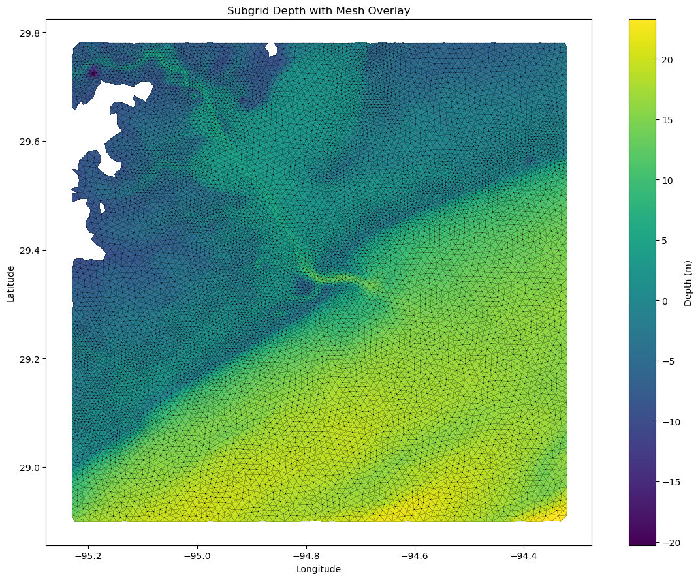
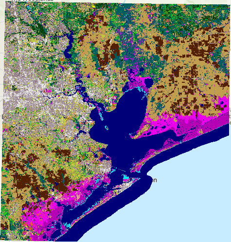
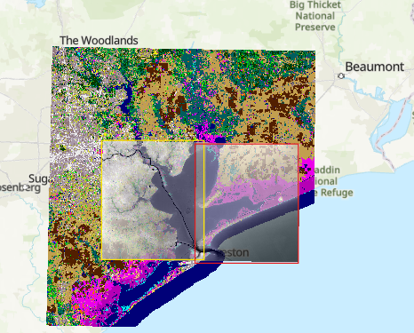
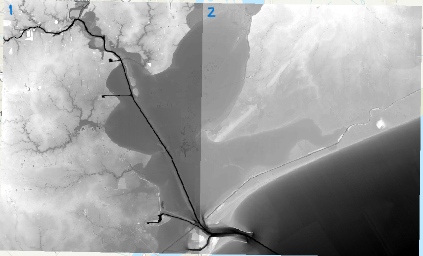
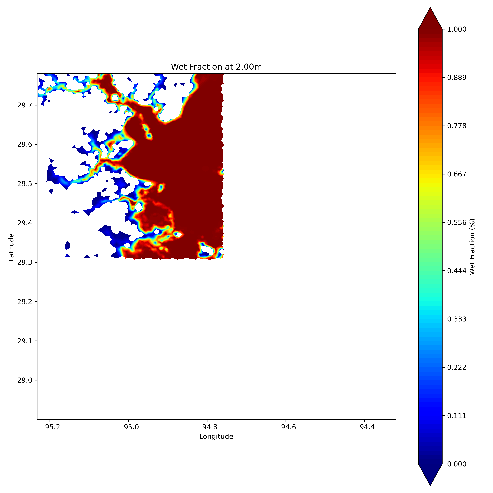
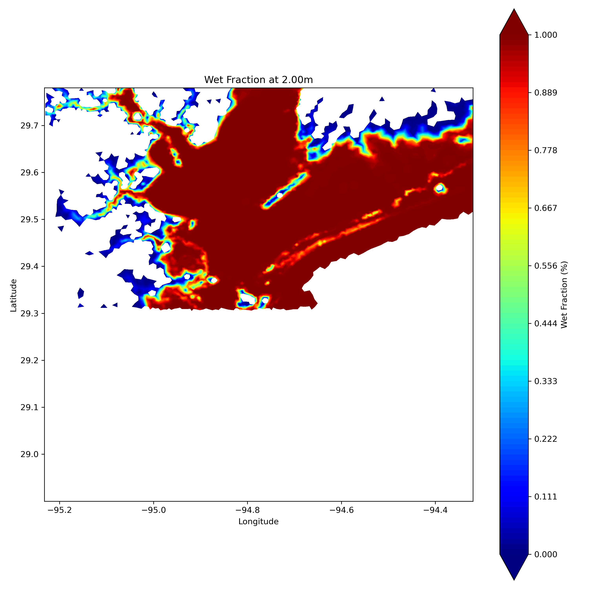

OBJECTIVE:

The objective of this exercise is to become familiar with the ADCIRC-Subgrid modeling system. You will work with the ADCIRC mesh or grid, illustrated in _Figure 1_, where elevation is represented through a color-coded bar, overlaid with triangular grid elements. Upon executing the ADCIRC-Subgrid model, this grid will use high-resolution elevation and land use data. The simulation  in this example integrates and interpolates detailed information from two separate TIF files, enhancing the grid with subgrid-scale resolution and lookup tables derived from the input datasets.

GOALS of this example:
- download and set-up ADCIRC-Subgrid
- run the ADCIRC subgrid
- view the results

<p align="center">
  
  <br>
  <em>Fig 1:The ADCIRC grid used in this example</em>
</p>

This folder contains 2 raster elevation files and 1 raster landcover file,
and was created to run the subgrid preprocessor code over multiple datasets.

Here is a step-by-step guide to running the example.

# Step 0: Download data from git

You can clone the data from GitHub from your local desktop command line.
You have to have GitHub installed on your desktop from the [site for Windows](https://git-scm.com/downloads/win)

```bash
git clone https://github.com/waterinstitute/adcirc-subgrid.git
```
For the first time, you would have to input your git user id and password.

Alternatively, you can also download the data, as specifically needed, from git-lfs before running the code.

```commandline
git lfs fetch
git lfs pull
git lfs checkout
gunzip fort.14.gz
```


There should be 3 TIF files:

0. 2021_CCAP_J1139301_4326.tif 
  This is a land use map from the 2021 Coastal Change Analysis Program [C-CAP](https://coast.noaa.gov/digitalcoast/data/ccaphighres.html)
  near Houston, Texas. This file is in Geographic Co-ordinates WGS 1984 (EPSG:4326), which, when projected, would have a cell size of ~30m. 
  The file, shown in _Figure 2_ will be used in both runs.
  
<p align="center">
  
  <br>
  <em>Fig 2: 2021 CCAP land use map of Houston, Texas</em>
</p>

1. galveston_13_mhw_20072.TIF:
  Digital elevation model (DEM) for one section of the Houston, Texas region. It's also in WGS 1984 with 1/9th Arc resolution.

3. galveston_13_mhw_20073.TIF:
  Digital elevation model for second section of the Houston, Texas region. It's also in WGS 1984 with 1/9th Arc resolution.
Both these files are labeld and shown in _Figure 3_.

<p align="center">
  
  
  <br>
  <em>Fig 3: The figure to the left shows the DEM location within the land use map. The figure to the right shows
    the 1/9th Arc resolution DEM 1 and 2</em>
</p>


# Step 1: Run Preprocessor Pass 1

Before this, you should have an adcirc-subgrid Python environment created with
the required packages. Activate the environment and run the subgrid preprocessor 
with `input.yaml` as input. This will use one of the DEM files, landcover file, 
and the mesh file to build a subgrid lookup table. The yaml file should look like 
this:

```yaml
input:
  adcirc_mesh: fort.14
  manning_lookup: ccap # Either a lookup file or 'ccap' to use the default table
  dem: galveston_13_mhw_20072.TIF
  land_cover: 2021_CCAP_J1139301_4326.tif

output:
  filename: subgrid.nc
  progress_bar_increment: 5

options:
  # Control for the number of subgrid levels for calculation and output
  n_subgrid_levels: 50 # Controls the number of levels the calculation is performed on
  n_phi_levels: 50 # Controls the number of phi levels between 0 and 1 where output is written

  # Control for the way the subgrid water levels are distributed
  subgrid_level_distribution: histogram # Either 'histogram' or 'linear'
```

To run adcirc subgrid in step 1, use the following code:
```bash
adcirc-subgrid prep input.yaml
```
After completion of Step 1, it should generate the subgrid.nc in the same folder the data
is in. 

# Step 2: Run Preprocessor Pass 2

Run subgrid preprocessor with `input_update_existing.yaml`. The updated yaml
contains an extra optional input line called "existing subgrid" where you
add the filepath of the existing subgrid. The `input_update_existing.yaml` 
now uses the second DEM and as the name suggests, it updates the existing 
information from Step 1 with the new information from the second DEM. 

So, running the preprocessor code again will use the second DEM file, but the 
same landcover file and mesh file to build and update the lookup table with 
subgrid values for the first and second DEMs included.

To run adcirc subgrid in step 2, use the following code:
```bash
adcirc-subgrid prep input_update_existing.yaml
```
After completion of Step 2, the results should be stored in the netCDF file
"subgrid_updated.nc" as specified in the yaml file.

# Step 3: View the Results

The results from the netCDF file from Steps 1 and 2 can be viewed using the 
provided codes in the source folder (../src/AdcircSubgrid).  

The command to view the percent wet at each element from Step 1, can be viewed
 using the following command:
```bash
import sys
sys.path.append(<path to src/AdcircSubgrid>)
import mesh_plot

mesh_plot.plot_mesh('subgrid.nc','percent_wet', 2 , True, 'after_percent_wet2')
```
After running the code, it should generate the percentage wet or the wet fraction 
at each element of the ADCIRC mesh as shown in _Figure 4_. The subgrid code recalculates
what fraction of an element is wet, for each element in the mesh, based on the 
DEM (in this case DEM 1) specified in the yaml file, i.e. used in Step 1. There are 
other parameters recalculated and you are encouraged to explore.

<p align="center">
  
  <br>
  <em>Fig 4: The percentage wet or the wet fraction at each element of the mesh
  corresponding to the first DEM after Step 1.</em>
</p>

Fig 5 shows the results after Step 2, the wet fraction at each element. This step only 
recalculates the wet fraction of an element using data from DEM 2 and appends the results 
Step 1. So the _Figure 5_ has the complete data from both the DEMs.

<p align="center">
  
  <br>
  <em>Fig 5: The percentage wet or the wet fraction at each element of the mesh
  corresponding to the first and second DEM after Step 2.</em>
</p>

## NOTE
  - The code will not overwrite the existing subgrid data, so use the highest priority datasets first.
  - It is recommended that you use a different name for the updated subgrid table to keep track of everything.
