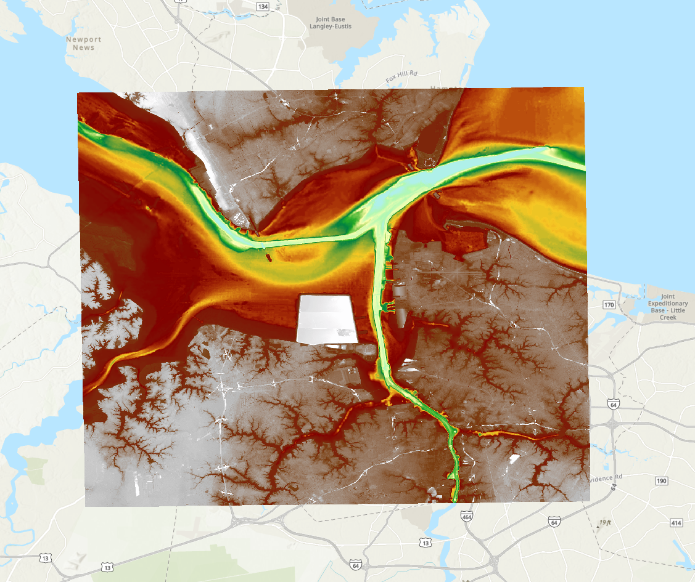

# Norfolk ADCIRC-Subgrid Example

This example explores how varying **Digital Elevation Model (DEM) resolution** impacts the **runtime performance** and **output characteristics** of the `adcirc-subgrid` preprocessing tool.

---

## Background

**Location:** Norfolk, Virginia and the surrounding Chesapeake Bay region.

Norfolk is a low-lying coastal city with complex shorelines, tidal inlets, and urban development — making it an ideal candidate for testing the effects of spatial resolution in subgrid modeling. High-resolution topographic and land cover data are available for this region, allowing for meaningful comparisons across multiple DEM scales.

---

## Objective

This example demonstrates how **DEM resolution** affects:

- The **computational performance** (runtime) of the `adcirc-subgrid` tool  
- The **subgrid characteristics** generated for use in ADCIRC flood simulations

By running the tool using three DEMs of increasing coarseness — **10m**, **30m**, and **100m** — users can investigate how resolution influences both speed and detail in subgrid generation.

---

## Key Questions

- How much does runtime improve as DEM resolution decreases?  
- How do subgrid-derived elevation and volume metrics vary with resolution?  
- What is the trade-off between computational cost and terrain fidelity?

---

## Workflow Overview

The example is divided into two main stages:

1. **Preprocessing**  
   The `adcirc-subgrid` tool is run three times, once for each DEM resolution. The runtime of each operation is recorded.

2. **Post-Processing & Analysis**  
   The outputs from each run are compared in terms of key subgrid metrics, such as:
   - Mean elevation
   - Elevation variability
   - Wet fraction
   - Total volume

Explore the following sections to walk through the full preprocessing and analysis process.

---

## Next Steps

- Start by reading the [Preprocessing Introduction](Preprocessing_intro.rst) to get a detailed overview of the preprocessing steps.  
- Next, open [Process_Norfolk.ipynb](Process_Norfolk.ipynb) to see how the subgrid generation was executed.  
- Then, read the [Post Processing Introduction](PostProcessing_intro.rst) to get an overview of the post-processing steps.  
- Finally, explore [PostProc_Norfolk.ipynb](PostProc_Norfolk.ipynb) to analyze differences in subgrid output across the different DEM resolutions.
