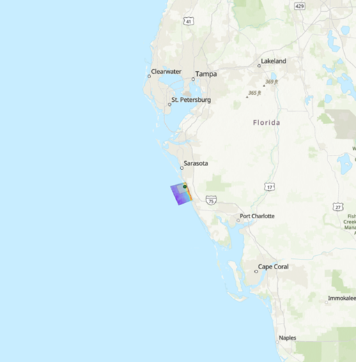
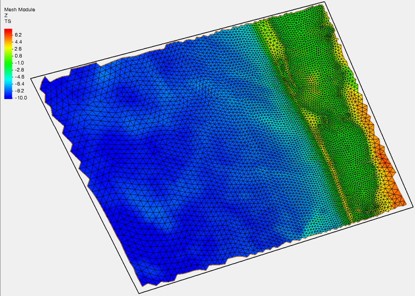
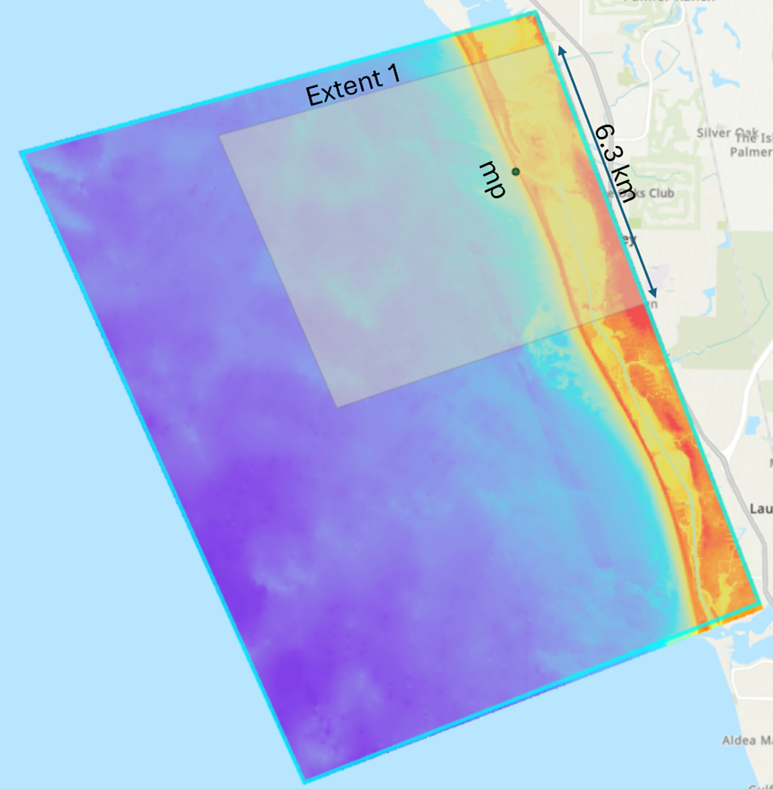

# ADCIRC-Subgrid Example

## ADCIRC-Subgrid Feature

I’m trying to show what the option `subgrid_level_distribution` does. It distributes the wet percentage in the DEM 
(based on the phi-levels) linearly or via histogram. It uses the source code `calculation_levels.py` to compute the 
levels of subgrid calculations or calculation intervals for water surface elevations.

**Research Question:**  
*How significant are the lookup table results when you choose histogram vs linear distribution for levels?*

## Geographic Region

I want to investigate south-west Florida, in the case of Helene, south of Tampa Bay. This area allows an investigation of 
water levels during the Midnight Pass formation (related to my own research).

The extent of the study area is shown in **Figure 1**.

  
   
  <em>Fig 1:The DEM and extents of the map</em>

## Mesh

I will use the **EGOM** mesh. It has a resolution of ~500m near the island. Only two elements cover the width of the land section 
I’m focusing on. Mesh resolution will not significantly impact results compared to the DEM resolution.

Focus area shown in **Figure 2**.

  
   
  <em>Fig 2:The HSOFS grid and focus sections</em>

## DEM

I plan to use a section of the combined DEM from the Helene XBeach runs (~3km on either side of Helene). 
It includes a high-resolution DEM and land use map (1m resolution). ADCIRC results from a prior project will also be reused.

DEM details shown in **Figure 3**.

  
   
  <em>Fig 3: The DEMs to be used within the example</em>

## Managing File Size

To reduce size, I’ll use only 2km on either side of Helene. DEM and land use map files will be zipped and cloned from the GitHub repo.

## Expected Results

I expect different DEM representations between histogram and linear distributions. It will be insightful to compare how well 
each technique captures topologic features and generates accurate flood maps.

## Delivery Method

This example will be delivered via a GitHub `README.md`, similar to the previous GBAY example.
