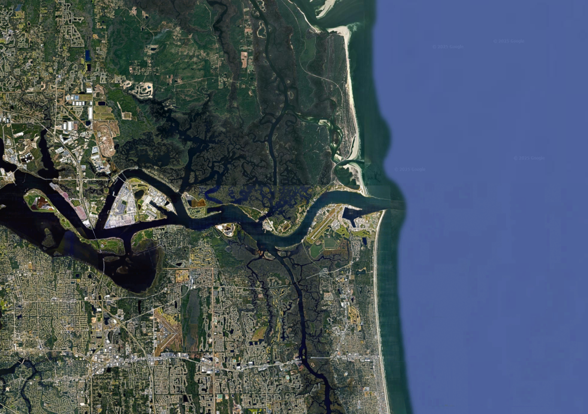
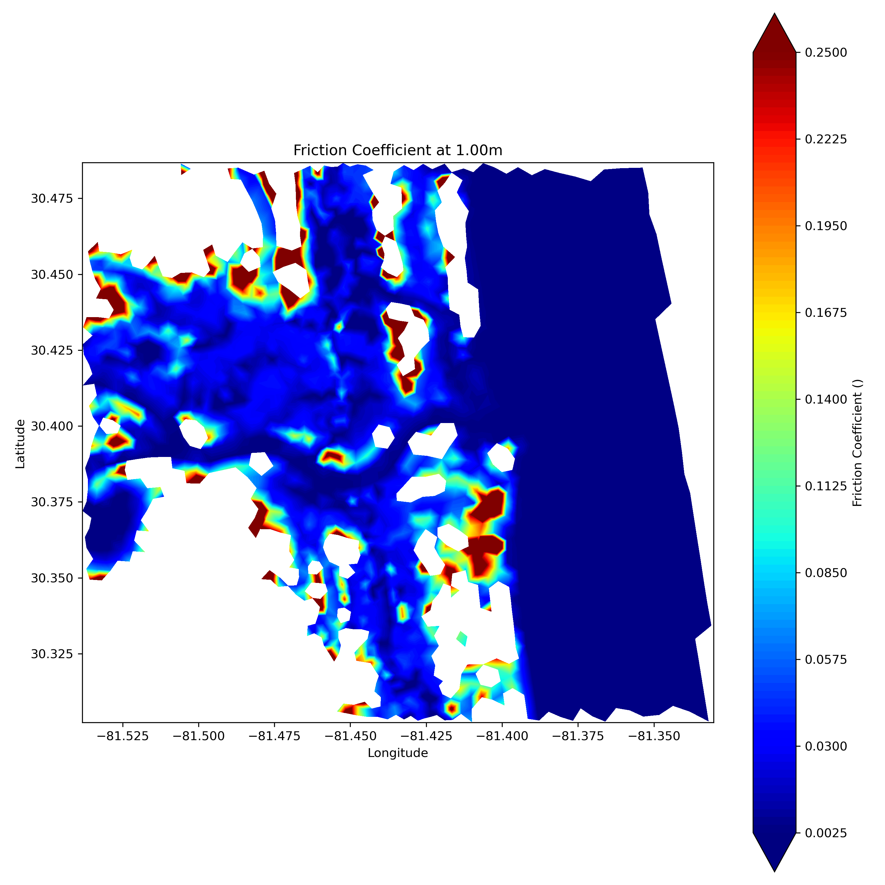
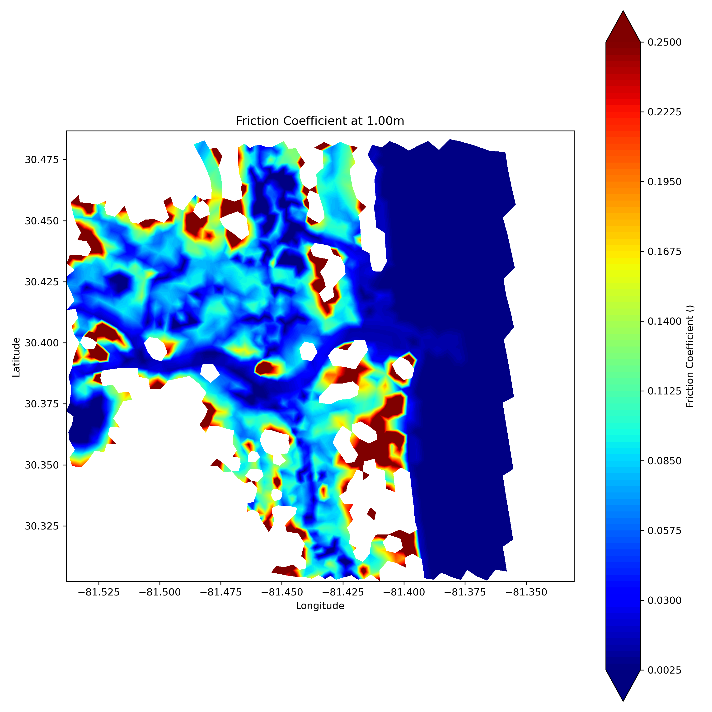

Example: Using Alternative Manning’s n Values in ADCIRC-Subgrid
================================================================

OBJECTIVE:
----------

The objective of this exercise is to demonstrate the capability in the ADCIRC-Subgrid preprocessor to use either the default C-CAP Manning’s *n* values or an alternative input file containing Manning’s *n* values, in this case from the NLCD.

This example uses a small region in Jacksonville, Florida with a variety of land cover types. It demonstrates how different Manning’s *n* inputs affect subgrid outputs, particularly the friction coefficient (``cf``), and shows how to visualize and compare results.

GOALS of this example:

* Run ADCIRC-Subgrid preprocessor with default C-CAP Manning’s *n* values
* Run ADCIRC-Subgrid preprocessor with user-defined NLCD Manning’s *n* values
* Visualize and compare the resulting outputs

   Fig 1: Region of interest Jacksonville, Florida

This example includes:

* ``fort.14``: ADCIRC mesh file
* ``JAX.tif``: Elevation raster
* ``ccap.tif``: C-CAP land cover raster
* ``nlcd.tif``: NLCD land cover raster
* ``nlcd.csv``: CSV file containing Manning’s *n* values for NLCD classes
* ``input_ccap.yaml``: Input file using default C-CAP Manning’s *n* values
* ``input_nlcd.yaml``: Input file using custom NLCD Manning’s *n* values

.. note::
   The use of the NLCD Manning’s *n* values here is for demonstration purposes only. These values have been intentionally exaggerated to include the higher than realistic Manning's n values. These values are not recommended defaults and are used to highlight how different land cover roughnesses affect the preprocessor outputs.

Step 0: Download Data from GitHub
---------------------------------

Clone the Subgrid repository and download the associated files from Git LFS:

.. code-block:: bash

   git clone https://github.com/waterinstitute/adcirc-subgrid.git
   cd adcirc-subgrid/examples/JAX
   git lfs fetch
   git lfs pull
   git lfs checkout

Download the larger files from the CCHT Google Drive: 

.. code-block:: bash

   wget https://go.ncsu.edu/subgrid-jax.zip
   unzip subgrid-jax.zip

Step 1: Run Preprocessor Using Default C-CAP Manning’s n
--------------------------------------------------------

The first step is to run the subgrid preprocessor using the default C-CAP Manning’s *n* values. The file ``input_ccap.yaml`` includes the necessary configuration:

.. code-block:: yaml

   input:
     adcirc_mesh: fort.14
     manning_lookup: ccap
     dem: JAX.tif
     land_cover: ccap.tif

   output:
     filename: subgrid_ccap.nc
     progress_bar_increment: 5

   options:
     n_subgrid_levels: 50
     n_phi_levels: 50
     subgrid_level_distribution: histogram

Run the preprocessor:

.. code-block:: bash

   adcirc-subgrid prep input_ccap.yaml

This will generate ``subgrid_ccap.nc`` containing the output from the default C-CAP run.

Step 2: Run Preprocessor Using NLCD Manning’s n
-----------------------------------------------

Now run the preprocessor again, this time using the NLCD raster and the extreme Manning’s *n* values defined in ``nlcd.csv``. The file ``input_nlcd.yaml`` is configured as follows:

.. code-block:: yaml

   input:
     adcirc_mesh: fort.14
     manning_lookup: nlcd.csv
     dem: JAX.tif
     land_cover: nlcd.tif

   output:
     filename: subgrid_nlcd.nc
     progress_bar_increment: 5

   options:
     n_subgrid_levels: 50
     n_phi_levels: 50
     subgrid_level_distribution: histogram

Always verify the format of your custom ``manning_lookup`` CSV file: it should have land cover class IDs in one column and Manning’s *n* values in the second column.
These values are the **extreme Manning’s n values** chosen to be represented using the NLCD classes and the upper range of Manning's n values:

.. code-block:: text

   11    0.05
   21    0.05
   22    0.12
   23    0.16
   24    0.20
   31    0.03
   41    0.20
   42    0.16
   43    0.20
   51    0.05
   52    0.16
   71    0.05
   72    0.05
   81    0.05
   82    0.05
   90    0.15
   95    0.085

Run the second configuration:

.. code-block:: bash

   adcirc-subgrid prep input_nlcd.yaml

This will create ``subgrid_nlcd.nc``, which uses the NLCD land cover and the user-defined Manning’s *n* values from the CSV.

Step 3: Visualize and Compare Results
-------------------------------------

You can compare the results from each run using the ``mesh_plot.py`` script located in the ``src/AdcircSubgrid/`` directory. For example, to visualize the friction coefficient (``cf``) from each file:

.. code-block:: python

   import sys
   sys.path.append('<path_to_src>/AdcircSubgrid')
   import mesh_plot

   # Plot C-CAP run results
   mesh_plot.plot_mesh("subgrid_ccap.nc", 'cf', 1, False, "ccap/cf_1m")

   # Plot NLCD run results
   mesh_plot.plot_mesh("subgrid_nlcd.nc", 'cf', 1, False, "nlcd/cf_1m")

   Fig 2: Friction coefficient computed using default C-CAP Manning’s *n* at 1m 

   Fig 3: Friction coefficient computed using custom NLCD Manning’s *n* at 1m 

Discussion of Results
---------------------

With the higher Manning’s *n* values in the NLCD-based scenario, the computed friction coefficients (*cf*) increase, which is visualized by the warmer color gradients in the figures.

The most notable difference appears in the open water regions. Under the default C-CAP case, Manning’s *n* is set to 0.025, whereas in the NLCD-based alternative, the value is doubled to 0.05. This increase results in a significantly higher *cf*, which is clearly visible in the comparison between Figures 2 and 3.  

It is important to emphasize that these Manning’s n values are not intended for practical application. Instead, they are selected as an extreme test case to demonstrate how a user could run the Subgrid Preprocessor with alternate land cover data and Manning’s n values. This exercise highlights how sensitive the subgrid outputs can be to the choice of surface roughness.